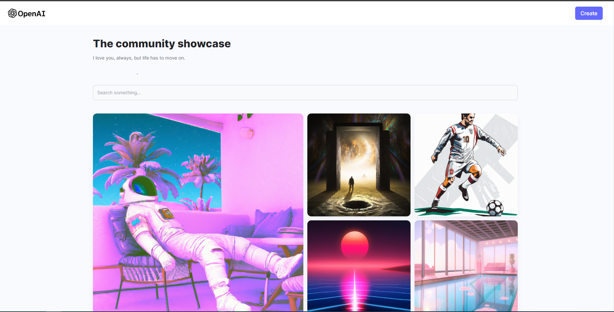

# AI Image Generator App

This AI Image Generator App is a web application built with React, Node.js, Express, and MongoDB. It uses the Dall-E API from OpenAI to generate images based on text descriptions.

The app allows users to enter a text description of an image they would like to generate. The app then uses the Dall-E API to generate an image based on the description. The generated image can be saved to the user's account and viewed later.

The app is deployed on Netlify and can be accessed at https://stalwart-narwhal-341a79.netlify.app/.

## Features

- Generate images based on text descriptions
- Download the picture
- View saved images

## Technologies Used

- React
- Node.js
- Express
- MongoDB
- Dall-E API from OpenAI

# Showcase

